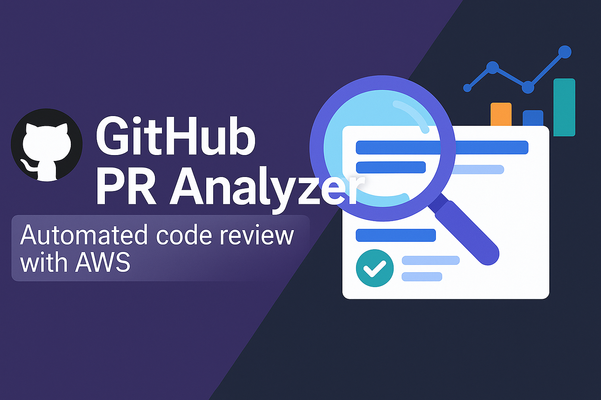
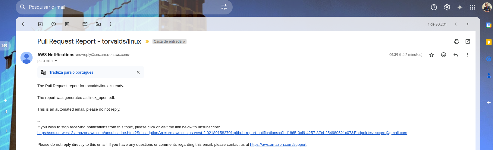
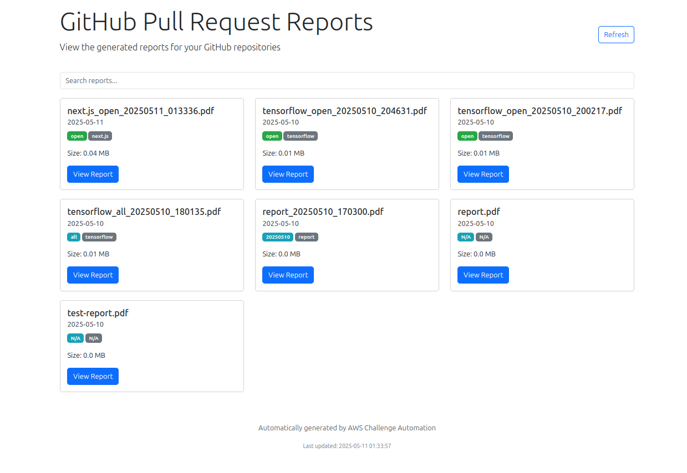
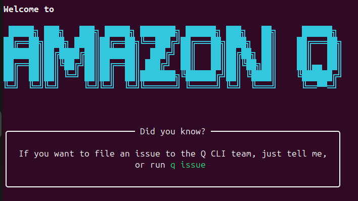

# GitHub PR Analyzer 🌟



A command-line tool that automates code review in GitHub repositories, generating detailed PDF reports and making them available through a web interface. 🚀

## Features 🎯

* **Pull Request Analysis** 📋: Extracts detailed information about PRs (open, closed, or all)
* **Code Analysis** 🔍: Detects issues like TODOs, FIXMEs, and files with many changes
* **Date Filtering** 🗓️: Allows analyzing PRs created in the last N days
* **Multiple Repository Support** 📦: Analyzes multiple repositories in a single report
* **PDF Reports** 📄: Generates detailed reports in PDF format
* **Web Interface** 🌐: View all reports in a user-friendly web interface
* **Email Notifications** 📧: Receive alerts when new reports are generated

## Prerequisites ✅

* Python 3.9+ 🐍
* AWS account with access to create resources (S3, Lambda, SNS) ☁️
* GitHub personal access token 🔑
* Pulumi CLI installed ⚙️

## Installation 🛠️

1. Clone the repository:

   ```bash
   git clone https://github.com/vec21/aws-challenge-automation.git
   cd aws-challenge-automation
   ```

2. Create and activate a virtual environment:

   ```bash
   python -m venv venv
   source venv/bin/activate  # On Windows: venv\Scripts\activate
   ```

3. Install dependencies:

   ```bash
   pip install -r requirements.txt
   ```

4. Configure the GitHub token:

   ```bash
   export GITHUB_TOKEN=your_github_token
   # OR
   pulumi config set github_token your_github_token --secret
   ```

5. Configure AWS infrastructure with Pulumi:

   ```bash
   pulumi up
   ```

## Usage 🚀

### **Basic Commands** 🖥️

```bash
   # Analyze a repository 🌟
   python src/cli.py review-code --repo username/repository

   # Analyze with specific state (open, closed, all) 🔄
   python src/cli.py review-code --repo username/repository --state closed

   # Analyze with day limit 🗓️
   python src/cli.py review-code --repo username/repository --days 14

   # Perform code analysis 🔍
   python src/cli.py review-code --repo username/repository --analyze

   # Analyze multiple repositories 📦
   python src/cli.py review-code --repo "username/repo1,username/repo2"

   # Upload to S3 and generate web interface ☁️
   python src/cli.py review-code --repo username/repository --bucket bucket-name

   # Send email notification 📧
   python src/cli.py review-code --repo username/repository --notify --email your.email@example.com

   # Limit the number of processed PRs 📉
   python src/cli.py review-code --repo username/repository --limit 10
```

## **Complete Example** 🌈

### 🔍 Analyze a repository

```bash
python src/cli.py review-code --repo torvalds/linux
```

```
Reviewing repository torvalds/linux  
Connected to repository: torvalds/linux  
Found 469 pull requests with state 'open'  
Processing up to 100 pull requests...  
Processing PR #1229 (1/100)  
Processing PR #1228 (2/100)  
Processing PR #1227 (3/100)  
...
PDF report generated: linux_open.pdf 📄
```

📄 [View PDF report](screenshots/linux_open.pdf)

### 🟢 Analyze with specific state (e.g., closed)

```bash
python src/cli.py review-code --repo torvalds/linux --state closed
```

```
Reviewing repository torvalds/linux
Connected to repository: torvalds/linux
Found 656 pull requests with state 'closed'
Processing up to 100 pull requests...
Processing PR #1223 (1/100)
Processing PR #1219 (2/100)
Processing PR #1217 (3/100)
        ...
PDF report generated: linux_closed.pdf 📄
```

📄 [View closed state analysis](screenshots/linux_closed.pdf)

### 🗓️ Analyze with day limit (last 14 days)

```bash
python src/cli.py review-code --repo microsoft/vscode --days 14
```

```
Reviewing repository microsoft/vscode  
Connected to repository: microsoft/vscode  
Found 545 pull requests with state 'open'  
Processing up to 100 pull requests...  
Processing PR #248625 (1/100)  
Processing PR #248616 (2/100)  
Processing PR #248552 (3/100)  
...  
PDF report generated: vscode_open.pdf 📄
```

📄 [View PDF report (last 14 days)](screenshots/vscode_open.pdf)

### 🧠 Perform code analysis

```bash
python src/cli.py review-code --repo tensorflow/tensorflow --analyze
```

```
Reviewing repository tensorflow/tensorflow
Connected to repository: tensorflow/tensorflow
Found 7997 pull requests with state 'open'
Processing up to 100 pull requests...
Processing PR #93105 (1/100)
Processing PR #93104 (2/100)
Processing PR #93103 (3/100)
         ...
Processing PR #92935 (100/100)
Limit of 100 PRs reached. Use --limit to increase.
PDF report generated: tensorflow_open.pdf 📄
```

📄 [View code analysis](screenshots/tensorflow_open.pdf)

### 📦 Analyze multiple repositories

```bash
python src/cli.py review-code --repo "microsoft/vscode,tensorflow/tensorflow"
```

```
Reviewing repository microsoft/vscode
Connected to repository: microsoft/vscode
Found 545 pull requests with state 'open'
Processing up to 100 pull requests...
Processing PR #248625 (1/100)
Processing PR #248616 (2/100)
          ...
Processing PR #246051 (55/100)
Reviewing repository tensorflow/tensorflow
Connected to repository: tensorflow/tensorflow
Found 7996 pull requests with state 'open'
Processing up to 100 pull requests...
Processing PR #93104 (1/100)
Processing PR #93103 (2/100)
Processing PR #93101 (3/100)
          ...
Processing PR #92935 (99/100)
Processing PR #92934 (100/100)
Limit of 100 PRs reached. Use --limit to increase.
PDF report generated: multi-repos_open.pdf 📄
```

📄 [View multiple repositories](screenshots/multi-repos_open.pdf)

### ☁️ Upload to S3 and generate web interface

```bash
python src/cli.py review-code --repo vercel/next.js --bucket vec21-aws-challenge
```

```
Reviewing repository vercel/next.js
Connected to repository: vercel/next.js
Found 762 pull requests with state 'open'
Processing up to 100 pull requests...
Processing PR #79040 (1/100)
Processing PR #79039 (2/100)
Processing PR #79038 (3/100)
           ...
Processing PR #78378 (99/100)
Processing PR #78340 (100/100)
Limit of 100 PRs reached. Use --limit to increase.
PDF report generated: next.js_open.pdf 📄
Report uploaded to S3: https://vec21-aws-challenge.s3.amazonaws.com/reports/2025-05-11/next.js_open_20250511_013336.pdf
```

📄 [View PDF report](https://vec21-aws-challenge.s3.amazonaws.com/reports/2025-05-11/next.js_open_20250511_013336.pdf)

### 📧 Send email notification

```bash
python src/cli.py review-code --repo torvalds/linux --notify --email veccpro@gmail.com
```

```
Reviewing repository torvalds/linux
Connected to repository: torvalds/linux
Found 469 pull requests with state 'open'
Processing up to 100 pull requests...
Processing PR #1229 (1/100)
Processing PR #1228 (2/100)
       ...
Processing PR #1203 (16/100)
Processing PR #1201 (17/100)
Processing PR #1199 (18/100)
PDF report generated: linux_open.pdf 📄
Notification sent to: veccpro@gmail.com 📧
```



### 📉 Limit the number of processed PRs (e.g., 10 PRs)

```bash
python src/cli.py review-code --repo vercel/next.js --limit 10
```

```
Reviewing repository vercel/next.js
Connected to repository: vercel/next.js
Found 762 pull requests with state 'open'
Processing up to 10 pull requests...
Processing PR #79040 (1/10)
Processing PR #79039 (2/10)
Processing PR #79038 (3/10)
Processing PR #79037 (4/10)
Processing PR #79036 (5/10)
Processing PR #79035 (6/10)
        ...
Processing PR #79022 (7/10)
Processing PR #79020 (8/10)
Processing PR #79021 (9/10)
Processing PR #79018 (10/10)
Limit of 10 PRs reached. Use --limit to increase.
PDF report generated: next.js_open.pdf 📄
```

📄 [View report](screenshots/next.js_open.pdf)

## Web Interface 🌐

After generating reports and uploading them to S3, you can access the web interface to view all available reports:

**Access URL:**
[View Reports](http://vec21-aws-challenge.s3-website-us-east-1.amazonaws.com)

The web interface allows you to:

* View all generated reports 📋
* Search reports by name, repository, or state 🔍
* Download PDF reports 📥
* See details such as creation date, size, and content ℹ️

To manually update the web interface:

```bash
export BUCKET_NAME=vec21-aws-challenge
python src/web_interface.py
```



## Architecture 🏗️

```bash

                                                  +-------------------+
                                                  |                   |
                                                  |  GitHub           |
                                                  |  Repositories     |
                                                  |                   |
                                                  +--------+----------+
                                                           | API Calls
                                                           v
+---------------+     Commands     +---------------+     +--+------------+
|               |                  |               |     |               |
|  Developer    +----------------->+  CLI Tool     +---->+  GitHub API   |
|               |                  |               |     |               |
+---------------+                  +-------+-------+     +---------------+
                                           |
                                           v
                          +----------------+------------------+
                          |                                   |
                          |  PDF Report Generation            |
                          |                                   |
                          +----------------+------------------+
                                           |
                                           v
+---------------+                 +--------+--------+                 +---------------+
|               |                 |                 |                 |               |
|  CloudWatch   +---------------->+  AWS Lambda     +---------------->+  Amazon📄 S3    |
|  Events       |  Scheduled      |                 |  Store Reports  |  Bucket       |
|               |  Execution      |                 |                 |               |
+---------------+                 +--------+--------+                 +-------+-------+
                                           |                                  |
                                           v                                  |
                                  +--------+--------+                         |
                                  |                 |                         |
                                  |  Amazon SNS     |                         |
                                  |  Topic          |                         |
                                  |                 |                         |
                                  +--------+--------+                         |
                                           |                                  |
                                           v                                  v
                                  +--------+--------+                +--------+--------+
                                  |                 |                |                 |
                                  |  Email          |                |  Web Interface  |
                                  |  Notification   |                |  (S3 Website)   |
                                  |                 |                |                 |
                                  +-----------------+                +-----------------+
```

*Generated by **Amazon Q** 🤖*

The project uses the following AWS services:

* **S3** ☁️: Storage for PDF reports and web interface hosting
* **Lambda** ⚡: Scheduled execution of code analysis
* **SNS** 📬: Email notification delivery
* **CloudWatch Events** ⏰: Scheduling of periodic executions

## How Amazon Q Developer Helped 🧠



Amazon Q Developer was instrumental in developing this tool through its specialized commands:

### `/dev` - Code Development 💻

* Generated the initial CLI skeleton with GitHub and S3 integration 🛠️
* Implemented the project's base structure using Pulumi for AWS infrastructure 🏗️
* Created the Lambda function for scheduled analysis execution ⚡
* Developed SNS integration for email notifications 📧

### `/review` - Review and Optimization 🔍

* Optimized code in `src/cli.py` by adding retry mechanisms to handle API rate limits ⚙️
* Improved PDF report generation with tables and advanced formatting 📄
* Suggested fixes for date comparison issues with different time zones 🌐
* Identified and fixed potential security issues 🔒

### `/test` - Test Generation 🧪

* Created unit tests for the project's main functions ✅
* Implemented integration tests to verify the complete flow 🔄
* Generated fixtures and mocks to simulate interactions with external services 🎭
* Configured the test structure with pytest 🛠️

### `/doc` - Documentation 📝

* Generated detailed documentation for functions and classes 📚
* Created the architecture diagram to visualize data flow 📊
* Produced usage examples for each feature 📖
* Developed the complete README with installation and usage instructions 📜

Amazon Q helped implement the 5 main features:

1. **Code analysis** 🔍: Detecting issues like TODOs, FIXMEs, and files with many changes
2. **Date filtering** 🗓️: Allowing analysis of PRs created in the last N days
3. **Email notifications** 📧: Sending alerts when new reports are generated
4. **Multiple repository support** 📦: Analyzing multiple repositories in a single report
5. **Web interface** 🌐: Providing a user-friendly interface to view reports

## Tests 🧪

### The project includes unit and integration tests:

```bash
# Install test dependencies
pip install -r requirements-test.txt

# Run all tests
pytest

# Run tests with coverage
pytest --cov=src
```

## License 📜

This project is licensed under the MIT license - see the [LICENSE](LICENSE) file for details.
